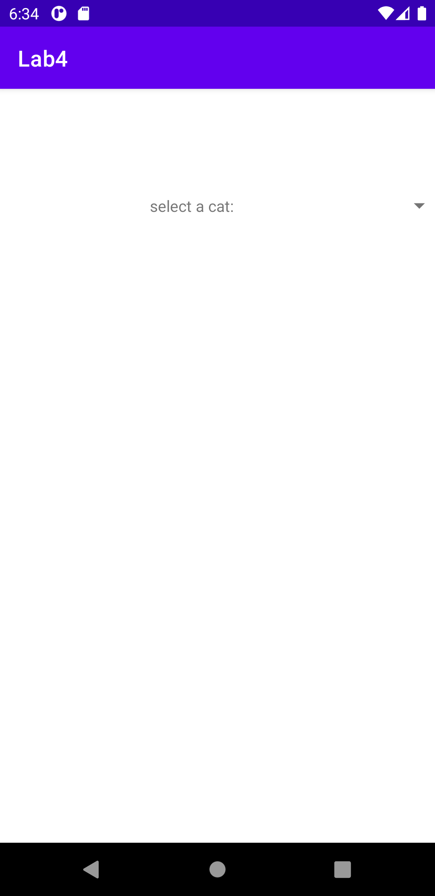
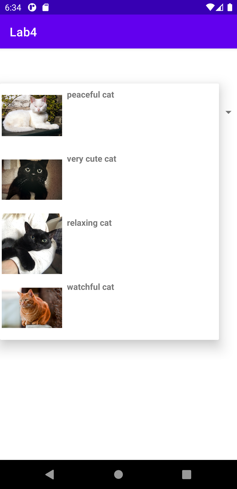
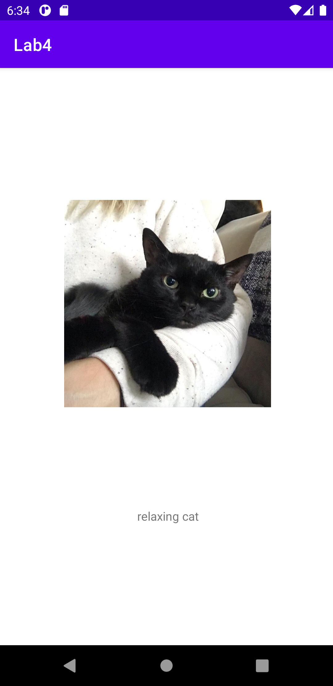

# 3515_lab4
# Grace Sobrinski

## Description
This lab was a modification on Lab 3. Instead of displaying an ImageView and TextView on the same page like in lab 3, we instead launched a new Activity and
displayed the ImageView and TextView on that page. 

The second portion of this lab was creating a custom icon and generating an APK. To create a custom icon, I had to add a new Image Asset and then change the icon
in the AndroidManifest. To create an APK, I had to find where my keystore was and then use that path to create my APK. I also had to alter the password settings
in the build.gradle file.

This is the startup page of the app (SelectionActivity)

This is the dropdown menu from the spinner, still in SelectionActivity.

If we click on one of the cats, a new activity DisplayActivity is spawned which shows the image and text related to the cat.

If we click back, it will return to SelectionActivity.
